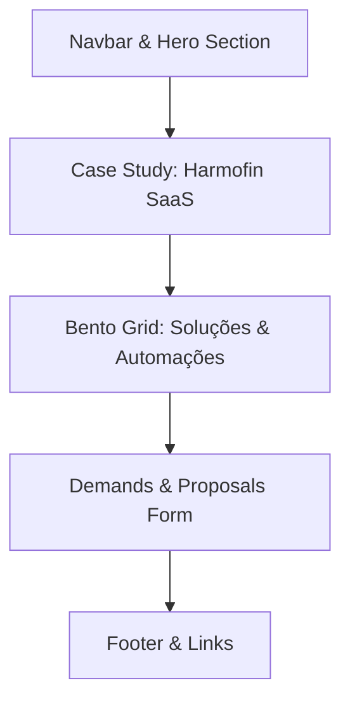

# OP Codes — Especificação de Design e Conteúdo da Landing Page

Este documento define a especificação técnica de design, identidade visual, tokens CSS, estrutura de layout e copywriting para a nova Landing Page da **OP Codes Software House**. 

O objetivo da página é atrair PMEs (Pequenas e Médias Empresas) e prestadores de serviços que buscam escala operacional através de automação inteligente de processos, inteligência artificial integrada (RAG, multi-agentes) e sincronização de ecossistemas (WhatsApp, CRM, ERP e Nota Fiscal).

---

## 1. Identidade Visual & Paleta de Cores (Premium Dark Theme)

A direção criativa adota um visual **Dark Mode Premium** (estética futurista de engenharia, limpa e de alta fidelidade) que transmite robustez técnica e sofisticação. Utiliza superfícies em vidro fosco (glassmorphism) sobre um fundo escuro profundo, com contrastes semânticos gerados por "dopamine pops" (neons altamente saturados que guiam a leitura do usuário).

### 1.1 Tabela de Cores

| Token | Valor Hex | Função na Interface |
| :--- | :--- | :--- |
| **`bg-base`** | `#08090A` | Fundo principal da página (Deep Charcoal / Black) |
| **`bg-surface`** | `#121417` | Fundo de cards, seções secundárias e inputs |
| **`bg-surface-hover`** | `#1A1D22` | Estado hover de cards e componentes interativos |
| **`border-subtle`** | `rgba(255, 255, 255, 0.06)` | Bordas finas de cards e divisores padrão |
| **`border-interactive`** | `rgba(255, 255, 255, 0.15)` | Estado focado ou hover de inputs e botões secundários |
| **`text-primary`** | `#F3F4F6` | Títulos e textos de alta legibilidade (Off-White) |
| **`text-secondary`** | `#9CA3AF` | Textos de apoio, descrições e subtítulos (Muted Gray) |
| **`accent-mint`** | `#10B981` | Accent principal. Usado em badges, CTAs e sucesso (Dopamine Mint) |
| **`accent-emerald`** | `#059669` | Gradientes de realce e profundidade de marca |
| **`accent-cyan`** | `#06B6D4` | Accent secundário para RAG, código e IA (Neon Cyan) |
| **`glow-opacity`** | `rgba(16, 185, 129, 0.15)`| Sombra de brilho (glow) para elementos selecionados |

---

## 2. Tipografia

A tipografia deve balancear a legibilidade corporativa com a precisão de um ambiente de desenvolvimento e automação (Developer/Code Aesthetic).

*   **Títulos & Headings (H1, H2, H3):** **Plus Jakarta Sans** ou **Geist Sans** (Sans-serif geométrica moderna).
    *   *Estilo:* Semibold / Bold, com kerning (espaçamento de letras) levemente reduzido (`letter-spacing: -0.02em`) para títulos grandes, transmitindo sofisticação técnica.
*   **Texto de Apoio & Corpo (Body text):** **Inter** ou **Plus Jakarta Sans** (Sans-serif limpa e altamente legível).
    *   *Estilo:* Regular / Medium (`font-weight: 400` / `500`), altura de linha confortável (`line-height: 1.6`).
*   **Badges Técnicos, Parâmetros e Logs (Monospace):** **Geist Mono** ou **JetBrains Mono** (Monospace técnica de programação).
    *   *Estilo:* Usado estritamente em pequenos textos de status, código-fonte, mapeamentos de variáveis de automação e badges informativos de integração.

---

## 3. Variáveis CSS (Custom Properties)

MANDATORY: As variáveis CSS estão concentradas no `:root` e configuradas de acordo com as diretrizes de acessibilidade e performance do navegador. O design é focado estritamente em **Dark Mode**, mas segue a especificação moderna de `color-scheme` e utiliza fallbacks para navegadores sem suporte ao `light-dark()`.

```css
:root {
  /* Declaração de suporte a color schemes (evita FOUC e ajusta scrollbars nativas) */
  color-scheme: dark;

  /* Raw Colors - Design System OP Codes */
  --raw-bg-base: #08090A;
  --raw-bg-surface: #121417;
  --raw-bg-surface-hover: #1A1D22;
  
  --raw-text-primary: #F3F4F6;
  --raw-text-secondary: #9CA3AF;
  
  --raw-accent-mint: #10B981;
  --raw-accent-mint-glow: rgba(16, 185, 129, 0.15);
  --raw-accent-cyan: #06B6D4;
  --raw-accent-cyan-glow: rgba(6, 182, 212, 0.15);
  
  --raw-border-subtle: rgba(255, 255, 255, 0.06);
  --raw-border-interactive: rgba(255, 255, 255, 0.15);

  /* Semantic Mappings */
  --color-bg-base: var(--raw-bg-base);
  --color-bg-surface: var(--raw-bg-surface);
  --color-bg-surface-hover: var(--raw-bg-surface-hover);
  
  --color-text-primary: var(--raw-text-primary);
  --color-text-secondary: var(--raw-text-secondary);
  
  --color-accent-primary: var(--raw-accent-mint);
  --color-accent-primary-glow: var(--raw-accent-mint-glow);
  --color-accent-secondary: var(--raw-accent-cyan);
  --color-accent-secondary-glow: var(--raw-accent-cyan-glow);
  
  --color-border: var(--raw-border-subtle);
  --color-border-hover: var(--raw-border-interactive);

  /* Glassmorphism Token */
  --glass-bg: rgba(18, 20, 23, 0.75);
  --glass-backdrop: blur(12px);
  --glass-border: rgba(255, 255, 255, 0.08);
  --glass-shadow: 0 8px 32px 0 rgba(0, 0, 0, 0.37);

  /* Spacing Grid (Sizer) */
  --space-xs: 0.25rem;
  --space-sm: 0.5rem;
  --space-md: 1rem;
  --space-lg: 1.5rem;
  --space-xl: 2rem;
  --space-xxl: 3rem;

  /* Font Families */
  --font-sans: 'Plus Jakarta Sans', 'Inter', system-ui, -apple-system, sans-serif;
  --font-mono: 'Geist Mono', 'JetBrains Mono', 'Fira Code', monospace;

  /* Custom Scrollbar Colors */
  --color-scrollbar-track: var(--raw-bg-base);
  --color-scrollbar-thumb: var(--raw-bg-surface-hover);
  scrollbar-color: var(--color-scrollbar-thumb) var(--color-scrollbar-track);
  scrollbar-width: auto; /* Para forçar renderização moderna no macOS */
}

/* Global Reset & Base Elements styles */
html {
  background-color: var(--color-bg-base);
  color: var(--color-text-primary);
  font-family: var(--font-sans);
  accent-color: var(--color-accent-primary);
  scroll-behavior: smooth;
}

body {
  margin: 0;
  padding: 0;
  min-block-size: 100dvb;
  overflow-x: clip; /* Evita overflow horizontal indesejado */
}

/* Custom Scrollbar fallback for older WebKit engines */
@supports not (scrollbar-color: auto) {
  ::-webkit-scrollbar {
    width: 10px;
    height: 10px;
  }
  ::-webkit-scrollbar-track {
    background: var(--color-scrollbar-track);
  }
  ::-webkit-scrollbar-thumb {
    background: var(--color-scrollbar-thumb);
    border-radius: 5px;
    border: 2px solid var(--color-scrollbar-track);
  }
  ::-webkit-scrollbar-thumb:hover {
    background: var(--color-border-hover);
  }
}
```

---

## 4. Estrutura de Seções da Landing Page



### Seção 1: Hero Section (A Apresentação)
*   **Layout:** Coluna única centralizada com um grid sutil de background (grid lines com opacidade de `0.02`). Badge superior contendo status técnico, seguido por título impactante com gradiente de mint a cyan, subtítulo focado em eficiência e CTAs em linha.
*   **Elementos Visuais:**
    *   Um componente interativo minimalista de "Console" ou "Terminal de Automação" simulando um script n8n inicializando processos operacionais.
    *   Glow gradient de fundo posicionado atrás do terminal.

### Seção 2: Case Harmofin (A Prova Real)
*   **Layout:** Grid de 2 colunas. 
    *   *Coluna da Esquerda:* Narrativa técnica e de negócios do SaaS próprio da OP Codes (Harmofin), evidenciando a capacidade de arquitetar soluções complexas para o mercado de saúde estética regulada (HOF).
    *   *Coluna da Direita:* Mockup de interface do dashboard/inbox do Harmofin (ou diagrama interativo do fluxo de captura de áudio com Gemini 2.5 Flash integrado ao banco PostgreSQL).
*   **Aparência:** Fundo em card de vidro fosco (`--glass-bg`) com bordas iluminadas.

### Seção 3: Bento Grid de Automações (O Ecossistema)
*   **Layout:** Grid de 3 colunas (responsivo via Container Queries e Flexbox wrap de segurança). Composto por 5 blocos (cards bento) com alturas e larguras variadas.
*   **Tecnologia de Grid Recomendada (CSS):**
    ```css
    .bento-grid {
      display: grid;
      grid-template-columns: repeat(3, 1fr);
      grid-auto-rows: minmax(180px, auto);
      gap: var(--space-lg);
    }
    
    @media (max-width: 1024px) {
      .bento-grid {
        grid-template-columns: repeat(2, 1fr);
      }
    }
    
    @media (max-width: 640px) {
      .bento-grid {
        grid-template-columns: 1fr;
      }
    }
    ```
*   **Blocos do Bento Grid:**
    1.  *Card 1 (Largura: 2 colunas, Altura: 2 linhas):* **Integração WhatsApp & IA (Conversacional).**
    2.  *Card 2 (Largura: 1 coluna, Altura: 2 linhas):* **Orquestração n8n & API Connect.**
    3.  *Card 3 (Largura: 1 coluna, Altura: 1 linha):* **Faturamento Automático (NF no Prazo).**
    4.  *Card 4 (Largura: 1 coluna, Altura: 1 linha):* **RAG Knowledge Assistant (Busca Semântica).**
    5.  *Card 5 (Largura: 1 coluna, Altura: 1 linha):* **SDR Multi-Agentes de Prospecção.**

### Seção 4: Formulário de Demandas (O Fechamento)
*   **Layout:** Layout de duas partes. 
    *   *Lado Esquerdo:* Instruções de preenchimento e estatísticas de retorno.
    *   *Lado Direito:* Formulário interativo estilo terminal de código, com campos de texto de alta fidelidade que acionam feedback visual imediato ao digitar.

---

## 5. Copywriting Completo (Em Português)

Abaixo está a cópia final e estruturada em seções para implementação direta. A voz da OP Codes é **direta, técnica, antipatia à burocracia (copiar/colar) e focada em métricas financeiras reais**.

### 5.1 Navbar
*   **Logo:** `[OP Codes]` (Monospace font, badge verde `#10B981`)
*   **Links de Navegação:**
    *   `/tecnologias` -> "Tecnologias"
    *   `/case-harmofin` -> "Case Harmofin"
    *   `/automacoes` -> "Automações"
*   **CTA Botão Navbar:** "Consultar Engenharia" (Estilo: Borda fina, texto aceso, background escuro).

---

### 5.2 Hero Section

*   **Micro-Badge Superior (Monospace):**
    ```
    ● OP_CODES_ENGINE_ACTIVE // v1.4.0
    ```
*   **Título Principal (H1):**
    "Sua operação não precisa de mais braços. **Precisa de códigos melhores.**"
    *(Nota de Design: O texto "códigos melhores" deve ter um gradiente de `--color-accent-primary` a `--color-accent-secondary` e brilho discreto).*

*   **Subtítulo:**
    "Elimine o copiar-e-colar manual entre planilhas, CRMs e ERPs. Desenvolvemos esteiras de automação e agentes de IA autônomos que integram seu ecossistema e escalam seu backoffice sem inflar sua folha de pagamento."

*   **Botão CTA Principal:** "Iniciar Diagnóstico Técnico"
    *(Estilo: Preenchido com `--color-accent-primary`, texto escuro `#08090A` para alto contraste, hover com glow suave).*
*   **Botão CTA Secundário:** "Ver cases no GitHub"
    *(Estilo: Outline branco transparente, fonte monospace).*

*   **Terminal do Hero (Simulação de Output Visual):**
    ```javascript
    // config.json - OP Codes Automation Engine
    {
      "cliente": "PME_Scale_Active",
      "sincronizacao": ["WhatsApp", "Bling_ERP", "HubSpot_CRM", "Emitir_NF"],
      "status": "OPERATIONAL_STABLE",
      "workflows": 14,
      "logs": "0 erros nas últimas 72 horas"
    }
    ```

---

### 5.3 Seção: Case Harmofin (Caso de Sucesso)

*   **Sub-título da Seção (Monospace):**
    `CASE STUDY // SAAS PRÓPRIO`
*   **Título da Seção:**
    "Harmofin: Como eliminamos 100% dos desvios de estoque de injetáveis de alto custo."
*   **Texto Descritivo:**
    "Clínicas de Harmonização Orofacial (HOF) sofrem diariamente com desperdício silencioso. Materiais de alto valor como toxina botulínica e bioestimuladores de colágeno são perdidos por falta de rastreabilidade exata de mililitros, frascos e lotes usados em cada procedimento.
    
    Para resolver este gargalo, projetamos do zero o **Harmofin**: uma plataforma SaaS estruturada sobre um banco de dados relacional robusto (**PostgreSQL**) e integrada com inteligência artificial. O profissional não precisa preencher relatórios manuais complexos: basta enviar um áudio de 15 segundos relatando o atendimento no inbox. 
    
    Nossa Cloud Function com **Gemini 2.5 Flash** interpreta a voz, mapeia o consumo de ml/lote do estoque, cria a ficha do cliente, agenda o retorno e dá baixa automática no banco. Segurança jurídica, conformidade ANVISA/LGPD e controle total de insumos em tempo real."

*   **Métricas de Sucesso (Bento layout no case):**
    *   **100%** de controle de estoque de injetáveis.
    *   **0%** de retrabalho burocrático de digitação de prontuários.
    *   **15 seg** para registrar um atendimento completo por voz.
    *   **Segurança:** Custom Claims e Row Level Security (RLS) protegendo dados médicos sensíveis.

---

### 5.4 Seção: Bento Grid de Automações

*   **Título Geral da Seção:**
    "Infraestrutura operacional sob medida para a sua escala."
*   **Subtítulo Geral da Seção:**
    "Não instalamos soluções prontas. Mapeamos seus fluxos manuais mais caros e programamos conexões nativas entre seus sistemas favoritos."

---

#### Bento Card 1: WhatsApp Conversacional & IA
*   **Badge (Monospace):** `INTEGRAÇÃO // WHATSAPP + IA`
*   **Título:** "Atendimento Inteligente 24 horas por dia."
*   **Descrição:** "Agentes treinados com o contexto real dos seus serviços qualificam leads frios, consultam a agenda de forma dinâmica e efetuam o agendamento de reuniões diretamente no seu CRM. Chega de deixar clientes esperando no fim de semana."
*   **Apoio Visual:** Fluxo simulando entrada de texto:
    `[Cliente: "Gostaria de agendar para terça"] -> [Agent AI: Consultando agenda... Horários disponíveis: 14h, 16h] -> [Salvar no CRM].`

#### Bento Card 2: Orquestração e Sincronização (n8n & APIs)
*   **Badge (Monospace):** `INFRA // N8N WORKFLOWS`
*   **Título:** "O coração operacional do seu negócio."
*   **Descrição:** "Sincronizamos seus sistemas de vendas (HubSpot, Pipedrive, ActiveCampaign) aos seus sistemas de operação interna e finanças (Bling, Omie, Tiny). Os dados fluem de forma bidirecional sem necessidade de intervenção humana."
*   **Apoio Visual:** Iconografia técnica conectando nós de sistemas com linhas brilhantes.

#### Bento Card 3: Faturamento & Emissão de NFs no Prazo
*   **Badge (Monospace):** `MÉTRICA // FINANÇAS`
*   **Título:** "Notas fiscais e cobranças automáticas."
*   **Descrição:** "Seu financeiro livre de tarefas repetitivas. Integração automática com sistemas de emissão fiscal. Assim que o pagamento é aprovado, a nota é emitida pelo ERP, anexada ao contrato e enviada ao cliente por e-mail ou WhatsApp."

#### Bento Card 4: Assistente RAG (Retrieval-Augmented Generation)
*   **Badge (Monospace):** `TECNOLOGIA // RAG ASSISTANT`
*   **Título:** "Sua base de conhecimento pesquisável."
*   **Descrição:** "Permita que seu time ou clientes consultem contratos complexos, políticas de compliance internas, manuais de produtos ou PDFs regulatórios usando linguagem natural. Respostas baseadas em fontes oficiais com citação de documentos de origem."

#### Bento Card 5: SDR Multi-Agente de Prospecção
*   **Badge (Monospace):** `AGENTES AUTÔNOMOS`
*   **Título:** "Prospecção inteligente em segundo plano."
*   **Descrição:** "Robôs programados para varrer fontes de leads, filtrar por fit demográfico, enriquecer contatos com e-mails/telefones corporativos e pontuar oportunidades (Lead Scoring) antes do primeiro contato humano."

---

### 5.5 Seção: Formulário de Demandas (O Diagnóstico)

*   **Título Principal:** "Chega de gargalos operacionais. **Desenhe seu sistema.**"
*   **Subtítulo:** "Fale diretamente com nossa equipe de engenharia. Analisamos seus processos manuais atuais e sugerimos uma arquitetura de integração sem compromisso."

*   **Campos do Formulário:**
    1.  **Nome Completo:** `[ input texto ]`
    2.  **E-mail Corporativo:** `[ input email ]`
    3.  **Nome da Empresa:** `[ input texto ]`
    4.  **Processo mais crítico a ser automatizado:** 
        *   `[ Select: "Vendas e Entrada de Leads (CRM/WhatsApp)" ]`
        *   `[ Select: "Faturamento e Emissão Fiscal (NF-e/ERP)" ]`
        *   `[ Select: "Integração Geral de Sistemas e Planilhas" ]`
        *   `[ Select: "Assistente de IA / RAG sobre Documentos" ]`
        *   `[ Select: "Outro processo manual sob medida" ]`
    5.  **Descreva resumidamente seus gargalos atuais:** `[ textarea: "Ex: Perco 2 horas por dia copiando dados de vendas do WhatsApp para o Bling e gerando notas manuais no emissor da prefeitura..." ]`

*   **Texto de Consentimento & LGPD:**
    "Ao enviar, você concorda em compartilhar estes dados técnicos para fins de contato comercial e diagnóstico gratuito. Seus dados estão protegidos sob nossa política de governança."
    
*   **Botão Enviar (CTA):** "Executar Diagnóstico Técnico ->"
    *(Design: Elemento central de destaque. Ao clicar, o botão deve rodar uma animação curta simulando uma linha de código compilando no terminal, indicando sucesso).*

---

### 5.6 Rodapé (Footer)

*   **Slogan:** "OP Codes — Software robusto. Processos inteligentes. Escala real."
*   **Links de Rodapé:**
    *   `/github` -> "Repositórios & Cases"
    *   `/linkedin` -> "Acompanhe nossa Engenharia"
    *   `/privacidade` -> "Política de Privacidade & LGPD"
*   **Copyright:** `© 2026 OP Codes. Todos os direitos reservados. Projetado para máxima performance.`

---

## 6. Especificação Técnica de Layout & UX/UI (Web Guidelines)

Para garantir que a Landing Page atinja os padrões mais elevados de Core Web Vitals (LCP, INP) e acessibilidade, o desenvolvimento deve seguir as seguintes diretrizes:

1.  **Layouts Flexíveis:** Cards do bento grid devem usar `minmax(min, 1fr)` para evitar quebras de layout em dispositivos menores (ex: viewports de 360px a 430px de smartphones modernos).
2.  **Backdrop Filter (Glassmorphic surfaces):** Para o efeito de vidro fosco, combine `backdrop-filter: blur(12px)` com `background-color: var(--glass-bg)` e utilize `overflow: clip` em cards para evitar sangramento de bordas.
3.  **Contraste e Acessibilidade (a11y):** Todo o texto principal deve possuir taxa de contraste mínima de 4.5:1 em relação ao fundo escuro. Textos secundários em `#9CA3AF` sobre fundo `#121417` alcançam contraste de 5.6:1, atendendo aos padrões WCAG AA.
4.  **Inputs Estilizados:** Inputs do formulário devem herdar a fonte monospace para dar o ar de terminal. O foco no input deve acionar um realce dinâmico na borda (`outline: 1px solid var(--color-accent-primary)` ou box-shadow contido de brilho).
5.  **Viewport Units Modernas:** Utilizar unidades dinâmicas (`dvh`, `dvw`) nas seções de tela cheia (Hero) para evitar saltos ou layouts quebrados provocados pela barra de endereços flutuante dos navegadores móveis (Safari iOS e Chrome Android).
